# 🤖 AI Automation Portfolio (n8n + LLM)

This repository showcases a collection of AI-powered automations built with **n8n**, **OpenAI**, **Google Sheets**, and supporting integrations.  
It is designed to demonstrate practical skills in:

- Building end-to-end workflows with AI
- Designing robust validation and retry logic
- Integrating systems and APIs through iPaaS
- Creating structured prompts and reliable outputs
- Logging, monitoring, and error handling in automation flows

You will find:
- Workflow descriptions
- Technical explanations
- Execution screenshots
- Exported JSON files

---

## 📌 1. Lead Auto-Classification (AI + Retry Logic)

### 🎯 Purpose
Automatically classify incoming leads as **high**, **medium**, or **low** priority based on a free-text description.

### 🧩 Tech Stack
- n8n
- Google Gemini 2.0 Flash
- Google Sheets
- Gmail

---

### 🖼 Screenshots
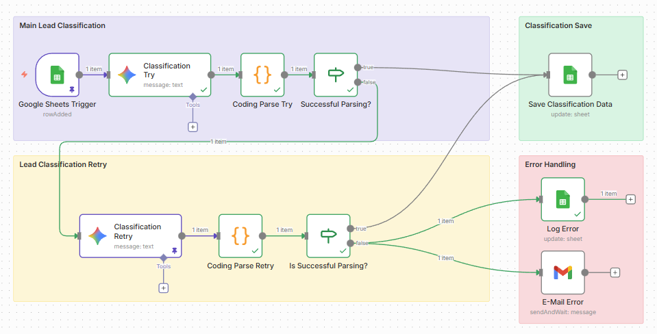
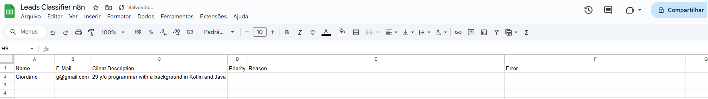
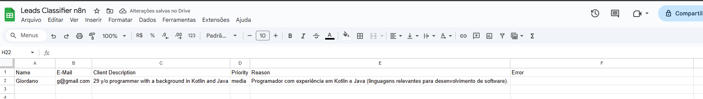
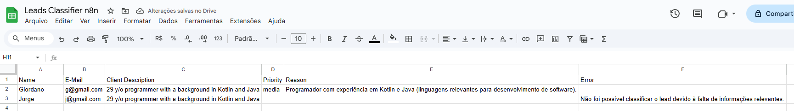

---

### 🧠 Technical Overview

- Trigger monitors a Google Sheets row insert.
- The LLM receives a structured classification prompt and must return a strict JSON schema.
- A JavaScript node parses and validates the JSON (type checks, required fields, allowed values).
- If parsing or validation fails, a **second AI attempt** is triggered with a more restrictive prompt.
- On success, the workflow updates the row; on repeated failure, an email alert is generated with debugging details.

---

### 🧾 Workflow Export (JSON)
[Auto-Classification Workflow.json](workflows/Auto-Classification%20Workflow.json)

---

## 📌 2. In Development — AI Ticket Intake

### 🎯 Objective
Automatically classify, summarize, and generate an initial response for support tickets sent through a webhook — with strict validation, retries, and structured output suitable for internal workflows.

### 🧩 Technologies
- n8n
- Webhook Trigger
- Google Gemini 2.0 Flash
- PostgreSQL
- Gmail
- JavaScript

### 🖼 Screenshots
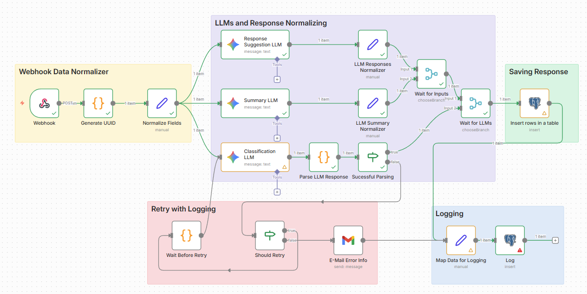
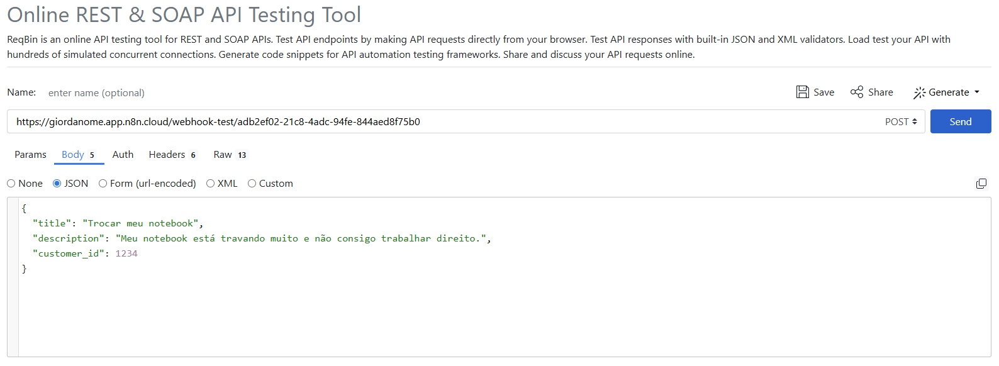
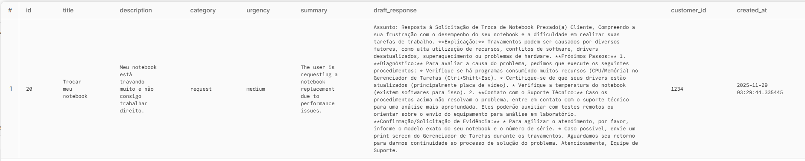
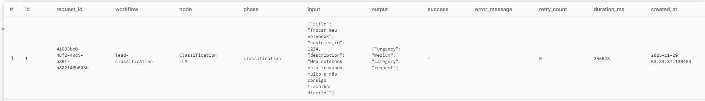

---

### 🧠 Technical Explanation
- Webhook receives the ticket payload (`title`, `description`, `customer_id`).
- Fields are normalized to ensure consistent input across all LLM prompts.
- Three independent Gemini models process the ticket:
    - **Classification:** category + urgency (strict JSON)
    - **Summary:** concise one-sentence summary for dashboards
    - **Suggested response:** a professional first reply for the requester
- A JavaScript node performs **strict JSON parsing and validation**:
    - checks schema, required fields, and types
    - triggers **automatic retries** (up to 3 attempts)
    - on final failure, an error email is sent
- Final structured data and logging is persisted in PostgreSQL for internal use.

---

### 🧾 Exported JSON
[AI Ticket Intake Workflow.json](workflows/AI%20Ticket%20Intake%20Workflow.json)

## 📌 3. Revenue Ops Automation

### 🎯 Objective
Automate the intake and processing of deals using AI, ensuring **data validation**, **Gemini enrichment**, **automatic classification**, generation of **next steps**, **KPIs**, and **smart Telegram notifications**.

### 🧩 Technologies
- n8n
- Schedule Trigger
- HTTP Request (JSON Mapping)
- Google Gemini 2.0 Flash
- PostgreSQL
- Google Sheets
- Gmail
- JavaScript
- Telegram

### 🖼 Screenshots
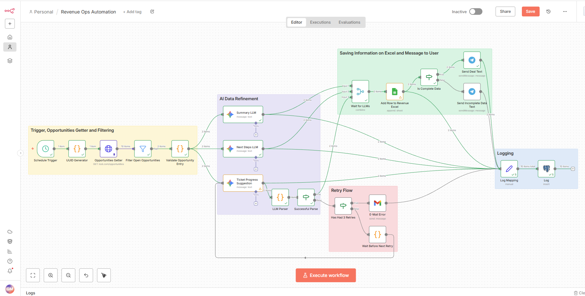
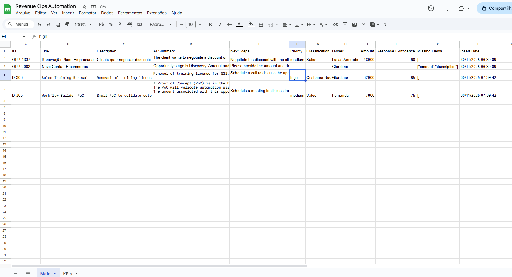
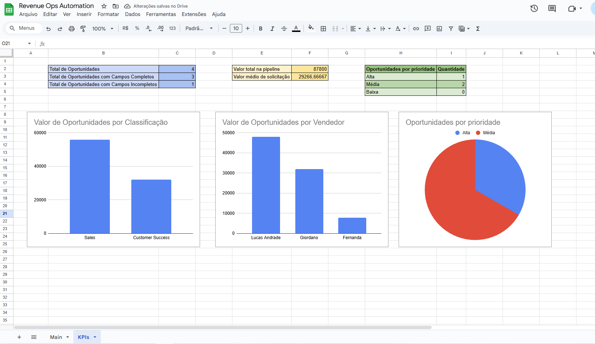
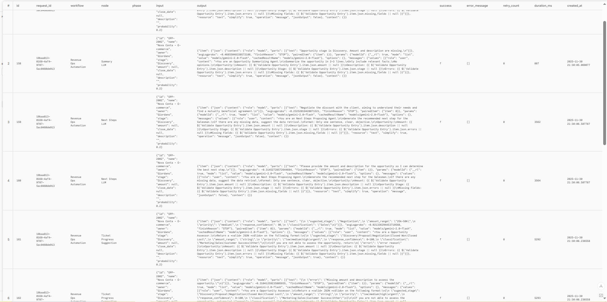
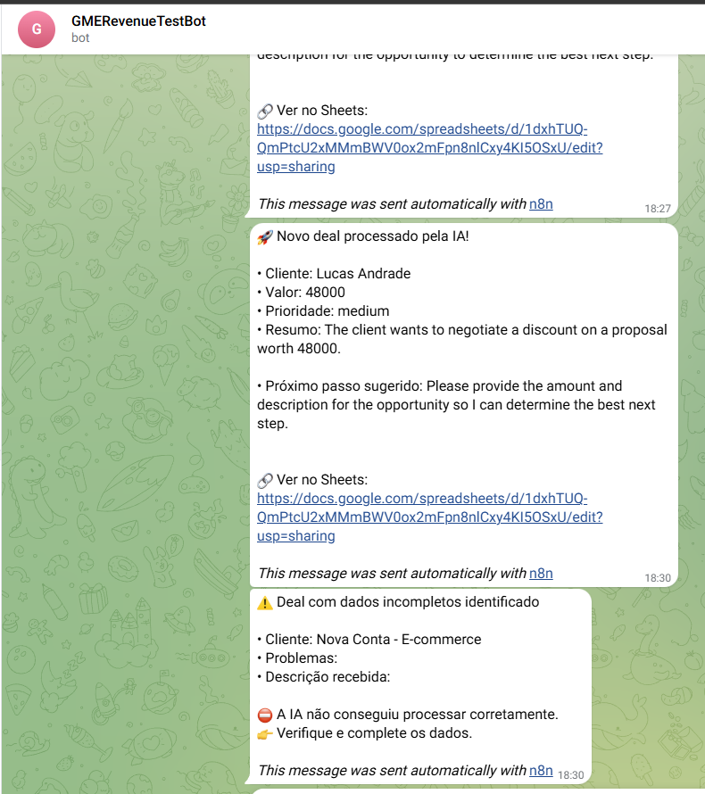

---

### 🧠 Technical Explanation
- Webhook trigger receives incoming deals and converts each item of the array into **independent executions** (Split in Batches / Item Lists).
- JavaScript validation checks required fields: `amount`, `description`, `close_date`, `stage`.
- Invalid fields are collected into a `missing_fields` array and guide the conditional routing.
- AI generates a structured object (`ai_summary`, priority, classification, next steps) with **strict JSON validation**.
- The flow includes **retry logic** when the AI returns invalid or non-schema-compliant responses.
- Google Sheets writes create a consolidated record: timestamps, original data, enriched fields, and errors.
- Telegram sends two types of messages:
  - Valid deals → standard notification
  - Deals with missing data → alert with highlighted missing fields
- Audit logs are stored in a separate sheet tab, including `uuid`, status, stage, and error payloads.

---

### 🧾 Exported JSON
[Revenue Ops Automation Workflow.json](workflows/Revenue%20Ops%20Automation%20Workflow.json)

## 📌 4. Governance & Cost Control Automation

### 🎯 Objective

Create an internal service focused on governance, usage transparency, and cost tracking for AI-powered workflows.  
This project implements a fully observable backend with structured logs, API-key–based access control, real-time error notifications, and automatic usage/cost reporting.  
It mirrors the requirements expected from production-grade GenAI platforms in large companies.

---

### 🧩 Technologies

- Spring Boot (Kotlin)
- SQLite
- JSON Logging
- API Key Interceptor
- Telegram
- Google Sheets API
- n8n
- PostgreSQL

---

### 🖼 Screenshots
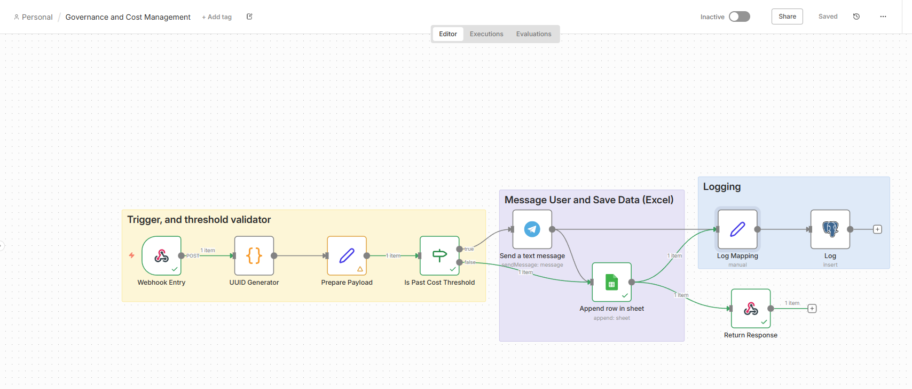
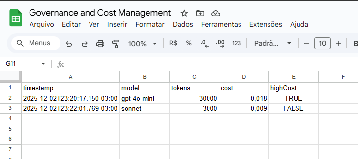
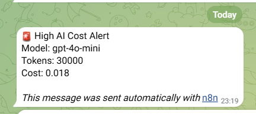

---

### 🧠 Technical Explanation

This backend exposes a `/v1/process` endpoint protected by a custom API Key interceptor.  
Every request is:

1. **Authenticated** — validated against a list of allowed API keys
2. **Logged** — using structured, JSON-formatted logs with correlation IDs
3. **Monitored** — errors trigger Telegram webhook alerts with full context
4. **Tracked** — request metadata (timestamp, user, endpoint, model name, tokens, cost) is appended to a Google Sheets cost ledger
5. **Summarized** — an n8n automation could run a daily summary generating:
  - total cost per model
  - number of requests per API key
  - error rate
  - week-over-week deltas

This combines governance, observability, compliance, and FinOps — exactly what real AI platform teams need.

---

### 🧾 Exported JSON
[Governance & Cost Control Workflow.json](workflows/Governance%20%26%20Cost%20Control%20Workflow.json)

---

### 🔗 Link to Kotlin Project
[Kotlin Project](https://github.com/gestevao04/governance-backend)

---
## 📎 Contact

If you'd like to discuss AI automation, workflow design, or n8n projects:

**gestevao04@gmail.com**  
**LinkedIn: https://www.linkedin.com/in/giordanome/**
